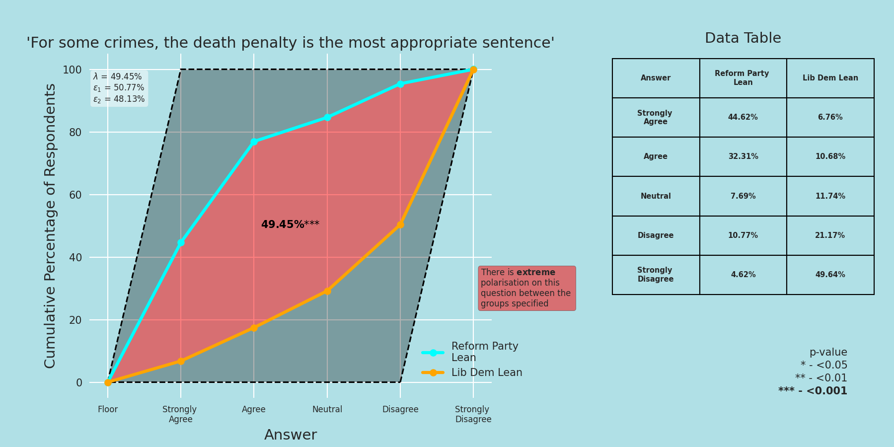

# Joeys-Pouch

Hi all! I'm Joey, a 23 year old from Nottingham with a lot of interests, one of which is doing fun things with data. So far I've worked primarily at universities but in a pretty diverse set of roles - from social statistics textbooks to back-end supply chain data migration. That said, I do have a real passion for quantitative surveys, higher education and 'turning attitudes into numbers'. Here you'll find some of the things I've made over the years. 

## Projects

[Political Wedges](https://z-for-zarrin.github.io/political_wedges/) (endearingly nicknamed 'Wedgesite' by my partner) is a graph generator that I wrote in Python, based on a statistical and visual framework I developed during my Master's Degree in Quantitative Politics. The idea is that you pick two societal groups and a question that interests you, and it'll auto-generate graphs that draw out the level of polarisation between two groups alongside some useful statistical information. It also has really nice mathematical properties (more on this below!). The web dev half was done by my incredibly talented partner, Zarrin. 
Here's an example of the output from the graph generator. Go and try it out yourself!

[This](https://z-for-zarrin.github.io/political_wedges/static/media/Parallelogram-Description-And-Proofs.7b2a9240744c616aec74.pdf) is a fairly academic introduction to the aforementioned framework. It goes through the geometric interpretations, the statistical proofs and all the lovely mathematical properties, as well as giving a couple of illustrative examples.

[This](https://github.com/JoeysPouch/OULA-XGBoost/blob/main/Jupyter%20Notebook.ipynb) is some analysis I did on the Open University Learning Analytics Data Set - specifically, the characteristics of 'high achievers' and the ways in which they interact with their online learning environments. I was a bit bored of learning about 'average score at university of x demographic compared to y' so decided to dig a bit deeper into the tail ends of the distribution and explored the characteristics of real high fliers. It uses XGBoost, a machine learning algorithm based on ensembles of decision trees.

If you're interested, here are a couple of papers I wrote at university in the area of quantitative public opinion: 

- [This](MA_Dissertation.pdf) is my dissertation! It's sort of on both of the topics above. It was my first attempt at applying the polarisation parallelogram to an actual set of issues.
- [This](PO92Q_LaTeX.pdf) started out as a paper on public attitudes to immigration but ended up more as a critique of the way that 'political ideology' is often quantified and measured in social surveys.

I'm also hoping to be able to share the bank of questions I wrote for an upcoming Oxford University textbook on Social Data Science soon!
